<div align="center">



<br/>


&nbsp;

&nbsp;
<a href="https://twitter.com/sajalsky1765"></a>

</div>

---

```
┌──────────────────────────────────────────────┐
│  STATUS       : 🟢 ONLINE & BUILDING          │
│  FOCUS        : Agentic AI Systems            │
│  STACK        : TypeScript / Next.js / Web3   │
│  CURRENT ARC  : Polaris Fellowship — Round 2   │
└──────────────────────────────────────────────┘
```

```js
const sajal = {
  name       : "Sajal Kumar",
  role       : "AI Engineer • Full-Stack Dev • Web3 Builder",
  focus      : ["Agentic Systems", "Loop Engineering", "AI x Hardware"],
  building   : ["Bookmark Brain", "AgenPay", "Wisper"],
  portfolio  : "https://sajalyadav.vercel.app",
  contact    : "sajalkumar1765@gmail.com",
  funFact    : "I'm hilarious (allegedly) ⚡",
  openTo     : ["collaborations", "open source", "cool ideas"],
};
```

---

### 🕹️ Currently Building

| Project | What it does |
|---|---|
| 🔖 **Bookmark Brain** | Chrome extension (Manifest V3 + TypeScript) — local semantic search over bookmarks using on-device embeddings |
| 💸 **AgenPay** | AI-native crypto payment infra on Sei Network, agent-driven via LangGraph |
| 🎙️ **Wisper** | Conversation recorder app with a dark, glassy UI |
| 🧠 **Physical AI Wearable** | Helps people remember who they've met and what they talked about — Round 2, Polaris Fellowship 2026 |

---

### ⚡ Tech Stack

<div align="center">

**Frontend**
<br/>


**Backend & Data**
<br/>


**AI / Web3 / Automation**
<br/>


**Tools & Infra**
<br/>


</div>

---

### 📈 Contribution Snake

<div align="center">

<picture>
  <source media="(prefers-color-scheme: dark)" srcset="https://raw.githubusercontent.com/ydvSajal/ydvSajal/output/github-contribution-grid-snake-dark.svg" />
  <source media="(prefers-color-scheme: light)" srcset="https://raw.githubusercontent.com/ydvSajal/ydvSajal/output/github-contribution-grid-snake.svg" />
  
</picture>

</div>

> ⚠️ Requires a one-time setup — see **"Enabling the snake animation"** in the setup notes below.

---

### 📊 GitHub Stats

<div align="center">


&nbsp;


</div>

### 📉 Activity Graph

<div align="center">


</div>

---

### 🌐 Connect

<div align="center">

[](https://sajalyadav.vercel.app/#contact)
[](https://www.linkedin.com/in/sajal-kumar-6a0b5930a/)
[](https://twitter.com/sajalsky1765)
[](https://stackoverflow.com/users/30765158/ydvsajal)
[](mailto:sajalkumar1765@gmail.com)

</div>

<div align="center">
  
</div>
